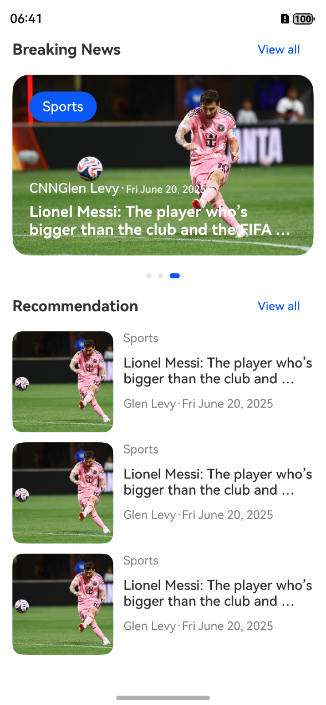

# HarmonyOS 5 新闻应用首页实现案例

## 内容摘要
本文介绍了在 HarmonyOS 5 中实现新闻应用首页的方法。借助提供的 ArkTS 代码，实现了包含轮播图新闻展示、推荐新闻列表展示的首页界面，同时支持点击“查看全部”跳转到新闻列表页面。并使用 `img01.png` 作为效果图展示界面。

## 实现步骤
1. 定义导航路径栈 `pathStack`。
2. 定义新闻数据模型 `NewsModel`。
3. 实现 `BannerNewsItem` 组件用于轮播图新闻展示。
4. 实现 `ListNewsItem` 组件用于推荐新闻列表展示。
5. 实现 `TitleBar` 组件作为标题栏，支持点击“查看全部”跳转。
6. 模拟新闻数据 `mockData`。
7. 实现 `PreviewPage` 作为入口组件，组合上述组件构建首页界面。

## 落地代码
```typescript
const pathStack = new NavPathStack() 

interface NewsModel { 
  id: string 
  author: string 
  company: string
  companyLogo: ResourceStr
  time: string 
  title: string, 
  category: string, 
  cover: ResourceStr 
} 

@Component 
struct BannerNewsItem { 
  news: NewsModel = {} as NewsModel 

  build() { 
    Stack() { 
      Image( this .news.cover) 
        .width('100%') 
        .height('100%') 
      Column({ space: 8 }) { 
        Button( this .news.category) 
          .size({ height: 36 }) 
        Blank() 
        Text() { 
          Span( this .news.company) 
          Span( this .news.author) 
          Span('·') 
          Span( this .news.time) 
            .fontSize(12) 
        } 
        .fontColor(Color.White) 
        .fontWeight(FontWeight.Medium) 

        Text( this .news.title) 
          .fontSize(18) 
          .fontColor(Color.White) 
          .fontWeight(FontWeight.Bold) 
          .maxLines(2) 
          .textOverflow({ overflow: TextOverflow.Ellipsis }) 
      } 
      .padding(20) 
      .width('100%') 
      .height('100%') 
      .alignItems(HorizontalAlign.Start) 
    } 
    .width('100%') 
    .aspectRatio(5 / 3) 
    .borderRadius(20) 
    .clip( true ) 
  } 
} 

@Component 
struct ListNewsItem { 
  news: NewsModel = {} as NewsModel 

  build() { 
    Row({ space: 12 }) { 
      Image( this .news.cover) 
        .width(120) 
        .aspectRatio(1) 
        .objectFit(ImageFit.Cover) 
        .borderRadius(12) 
      Column({ space: 12 }) { 
        Text( this .news.category) 
          .fontColor(Color.Gray) 
          .fontSize(14) 
        Text( this .news.title) 
          .maxLines(2) 
          .textOverflow({ overflow: TextOverflow.Ellipsis }) 
          .fontWeight(500) 
        Text() { 
          Span( this .news.author) 
          Span('·') 
          Span( this .news.time) 
        } 
        .fontSize(14) 
        .fontColor(Color.Gray) 
      } 
      .width('100%') 
      .height(120) 
      .justifyContent(FlexAlign.Start) 
      .alignItems(HorizontalAlign.Start) 
      .layoutWeight(1) 
    } 
    .padding({ left: 15, right: 15 }) 
  } 
} 

@Component 
struct TitleBar { 
  title: string = '' 
  category: string = '' 

  build() { 
    Row() { 
      Text( this .title) 
        .fontSize(18) 
        .fontWeight(FontWeight.Bold) 
      Blank() 
      Button('View all') 
        .buttonStyle(ButtonStyleMode.TEXTUAL) 
        .fontSize(14) 
        .onClick(() => { 
          pathStack.pushPathByName('NewsListPage', this .category) 
        }) 
    } 
    .width('100%') 
    .padding({ left: 15, right: 15, bottom: 10 }) 
  } 
} 

const mockData: NewsModel[] = [ 
  { 
    id: '100', 
    author: 'Glen Levy', 
    company: 'CNN Indonesia',
    companyLogo: $r('app.media.news_cnn'),
    time: 'Fri June 20, 2025', 
    title: 'Lionel Messi: The player who’s bigger than the club and the FIFA Club World Cup tournament?', 
    cover: $r('app.media.news01'), 
    category: 'Sports' 
  }, 
  { 
    id: '101', 
    author: 'Glen Levy', 
    company: 'CNN Indonesia',
    companyLogo: $r('app.media.news_cnn'),
    time: 'Fri June 20, 2025', 
    title: 'Lionel Messi: The player who’s bigger than the club and the FIFA Club World Cup tournament?', 
    cover: $r('app.media.news01'), 
    category: 'Sports' 
  }, 
  { 
    id: '102', 
    author: 'Glen Levy', 
    company: 'CNN Indonesia',
    companyLogo: $r('app.media.news_cnn'),
    time: 'Fri June 20, 2025', 
    title: 'Lionel Messi: The player who’s bigger than the club and the FIFA Club World Cup tournament?', 
    cover: $r('app.media.news01'), 
    category: 'Sports' 
  } 
] 

@Entry 
@Component 
struct PreviewPage { 
  @State list: NewsModel[] = mockData 

  @Builder 
  PagesMap(name: string) { 
    if (name === 'NewsListPage') { 
      NewsListPage() 
    } 
  } 

  @Builder 
  BreakingNewsBuilder() { 
    Column() { 
      TitleBar({ category: 'All', title: 'Breaking News' }) 
      Swiper() { 
        ForEach( this .list, (item: NewsModel) => { 
          BannerNewsItem({ news: item }) 
        }) 
      } 
      .itemSpace(20) 
      .safeAreaPadding({ left: 15, right: 15, bottom: 40 }) 
    } 
  } 

  @Builder 
  RecommendNewsBuilder() { 
    Column() { 
      TitleBar({ category: 'All', title: 'Recommendation' }) 
      Column({ space: 12 }) { 
        ForEach( this .list, (item: NewsModel) => { 
          ListNewsItem({ news: item }) 
        }) 
      } 
    } 
  } 

  build() { 
    Navigation(pathStack) { 
      List() { 
        ListItem() { 
          this .BreakingNewsBuilder() 
        } 

        ListItem() { 
          this .RecommendNewsBuilder() 
        } 
      } 
      .width('100%') 
      .height('100%') 
    } 
    .mode(NavigationMode.Stack) 
    .navDestination( this .PagesMap) 
    .hideToolBar( true ) 
  } 
} 
```

## 效果图


## 总结
本案例借助 ArkTS 语言在 HarmonyOS 5 上实现了新闻应用的首页界面，包含轮播图新闻和推荐新闻列表展示，同时支持页面跳转功能。关键知识点涵盖组件的定义与组合、数据模型的使用以及导航功能的实现。