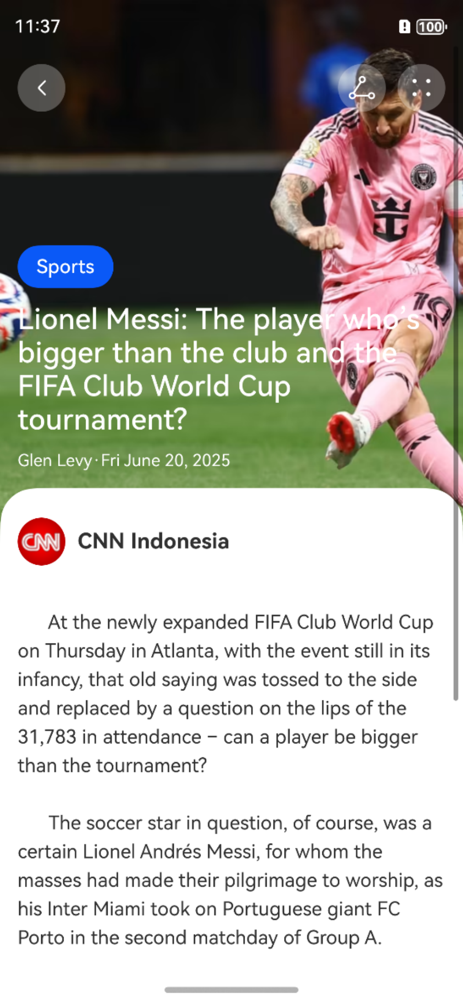

# HarmonyOS 5 新闻应用新闻详情页实现案例

## 内容摘要
本文详细介绍了在 HarmonyOS 5.0 中使用 ArkTS 语言实现新闻应用新闻详情页的方法。通过定义 `BarButton` 和 `NewDetailPage` 组件，实现了新闻详情页的界面布局、状态栏颜色设置以及页面导航等功能。

## 实现步骤
1. 定义 `BarButton` 组件，用于显示图标按钮。
2. 定义 `NewDetailPage` 组件，处理新闻详情页的业务逻辑。
3. 实现 `setStatusBarContentColor` 方法，用于设置状态栏颜色。
4. 构建 `CustomBarBuilder`、`TitleBuilder` 和 `ContentBuilder` 三个 `@Builder` 函数，用于构建页面不同部分的 UI。
5. 在 `build` 方法中组合各个组件，完成页面布局。

## 落地代码
```typescript
@Component 
struct BarButton { 
  icon: ResourceStr = '' 

  build() { 
    Row() { 
      Image(this.icon) 
        .width(24) 
        .height(24) 
        .fillColor(Color.White) 
    } 
    .justifyContent(FlexAlign.Center) 
    .width(40) 
    .aspectRatio(1) 
    .borderRadius(22) 
    .backgroundColor('#45FFFFFF') 
  } 
} 

@Component 
struct NewDetailPage { 
  news: NewsModel = {} as NewsModel 


  async setStatusBarContentColor(color: string) { 
    const ctx = this.getUIContext() 
      .getHostContext()! 
    const win = await window.getLastWindow(ctx) 
    win.setWindowSystemBarProperties({ 
      statusBarContentColor: color 
    }) 
  } 

  @Builder 
  CustomBarBuilder() { 
    Row({ space: 10 }) { 
      BarButton({ icon: $r('sys.media.ohos_ic_public_arrow_left') }) 
        .onClick(() => pathStack.pop()) 
      Blank() 
      BarButton({ icon: $r('sys.media.ohos_ic_public_share') }) 
      BarButton({ icon: $r('sys.media.ohos_ic_public_more') }) 
    } 
    .padding(15) 
    .width('100%') 
  } 

  @Builder 
  TitleBuilder () { 
    Column({ space: 12 }){ 
      Button(this.news.category) 
        .size({ height: 36 }) 
      Text(this.news.title) 
        .fontSize(24) 
        .fontWeight(FontWeight.Medium) 
        .fontColor(Color.White) 
      Text() { 
        Span(this.news.author) 
        Span('·') 
        Span(this.news.time) 
      } 
      .fontSize(14) 
      .fontColor(Color.White) 
    } 
    .padding(15) 
    .height(300) 
    .width('100%') 
    .justifyContent(FlexAlign.End) 
    .alignItems(HorizontalAlign.Start) 
  } 

  @Builder 
  ContentBuilder () { 
    Column(){ 
      Row({ space: 10 }){ 
        Image(this.news.companyLogo) 
          .width(40) 
          .aspectRatio(1) 
          .borderRadius(20) 
        Text(this.news.company) 
          .fontSize(18) 
          .fontWeight(FontWeight.Bold) 
      } 
      .width('100%') 
      .height(60) 
      Text(` 
      At the newly expanded FIFA Club World Cup on Thursday in Atlanta, with the event still in its infancy, that old saying was tossed to the side and replaced by a question on the lips of the 31,783 in attendance – can a player be bigger than the tournament? 

      The soccer star in question, of course, was a certain Lionel Andrés Messi, for whom the masses had made their pilgrimage to worship, as his Inter Miami took on Portuguese giant FC Porto in the second matchday of Group A. 

      But until a magical Messi moment in the 54th minute, the match was in danger of becoming a mere sideshow to supporters expressing their admiration – actually, more like unbridled passion – for the 37-year-old who has long cemented his status as one of the greats of the sport. And let’s face it: winning nearly everything of note for Barcelona and Paris Saint-Germain – as well as his country of Argentina, who is the reigning World Cup champion – doesn’t exactly hurt his case. 
      `) 
        .fontSize(16) 
        .lineHeight(24) 

    } 
    .borderRadius({ topLeft: 30, topRight: 30 }) 
    .backgroundColor(Color.White) 
    .padding(15) 
  } 

  build() { 
    NavDestination() { 
      List(){ 
        ListItem(){ 
          this.CustomBarBuilder() 
        } 
        ListItem(){ 
          this.TitleBuilder() 
        } 
        ListItem(){ 
          this.ContentBuilder() 
        } 
      } 
      .width('100%') 
      .height('100%') 
      .layoutWeight(1) 
    } 
    .hideTitleBar(true) 
    .backgroundImage($r('app.media.news01')) 
    .backgroundImageSize({ height: '60%', width: 'auto' }) 
    .backgroundImagePosition(Alignment.Top) 
    .onShown(() => this.setStatusBarContentColor('#FFFFFF')) 
    .onHidden(() => this.setStatusBarContentColor('#000000')) 
    .onReady((ctx) => { 
      this.news = ctx.pathInfo.param as NewsModel 
    }) 
  } 
} 
```

## 总结
本文实现了新闻应用新闻详情页的核心功能，关键知识点包括组件化开发、`@Builder` 函数的使用、状态栏颜色动态设置以及页面导航等。通过组件化开发，提高了代码的可维护性和复用性。

