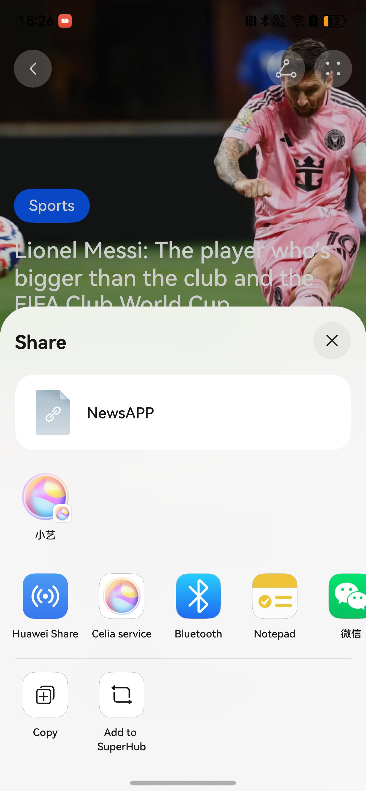

# HarmonyOS 5 新闻应用系统分享功能实现案例

## 内容摘要
本文详细介绍了在 HarmonyOS 5.0 新闻应用中实现系统分享功能的方法。借助 `BarButton` 组件和 `systemShare` 模块，实现了新闻链接的分享功能。



## 实现步骤
1. 创建 `BarButton` 组件实例，设置分享图标。
2. 为 `BarButton` 组件添加点击事件。
3. 在点击事件中创建 `SharedData` 对象，设置分享数据。
4. 创建 `ShareController` 实例，传入分享数据。
5. 获取 UI 上下文，调用 `show` 方法显示分享界面。

## 落地代码
```typescript
BarButton({ icon: $r('sys.media.ohos_ic_public_share') }) 
         .onClick(() => { 
           // system share 
           const data = new systemShare.SharedData({ 
             utd: uniformTypeDescriptor.UniformDataType.HYPERLINK, 
             title: 'NewsAPP', 
             content: ' `https://edition.cnn.com/` ' 
           }) 
           // 解释
           // utd：统一类型描述符，用于指定分享数据的类型，这里是超链接
           // title：分享标题，这里是新闻应用的名称
           // content：分享内容，这里是新闻应用的链接
           const controller = new systemShare.ShareController(data) 
           const ctx = this.getUIContext().getHostContext() as common.UIAbilityContext 
           controller.show(ctx, { 
             previewMode: systemShare.SharePreviewMode.DETAIL, 
             selectionMode: systemShare.SelectionMode.SINGLE 
           }) 
         }) 
```

## 接入模式
- 全接模式
直接使用系统分享面板，适用于华为自研应用以及对分享方式区无商业诉求的开发者，可直接使用系统面板，降低开发成本。
- 半接模式
开发者自行开发分享能力面板，并在分享面板中提供系统分享入口，适用于分享方式区有商业诉求，或有自己独有的业务逻辑的开发者。

## 总结
本文实现了新闻应用的系统分享功能，关键知识点包括 `systemShare` 模块的使用、`SharedData` 对象和 `ShareController` 实例的创建，以及如何在点击事件中触发分享操作。通过这些步骤，可方便地在 HarmonyOS 应用中集成系统分享功能。


## 适用场景

Share Kit（分享服务）为应用提供文本、图片、视频等内容跨应用、跨端分享能力。

应用把需要分享的内容和预览样式配置给Share Kit，Share Kit将根据不同的场景进行使用：针对应用间分享的场景，根据分享的数据类型、数量等信息构建分享面板，为用户提供内容预览、推荐分享联系人、关联应用及操作界面，便于用户快速选择分享应用或操作，将内容分发到目标应用。针对跨端分享的场景，根据分享的数据类型、数量等信息构建预览界面，用于跨端分享。

## 约束限制

宿主应用和目标应用定义数据类型须遵照UDMF（统一数据管理框架）定义的UTD（统一类型描述符）规范。目标应用需要在应用配置文件中，配置支持的类型。如支持全部图片类型，可声明为：general.image。
宿主应用配置分享数据描述信息总量不能超过200KB，且分享条目总量不能超过500条。