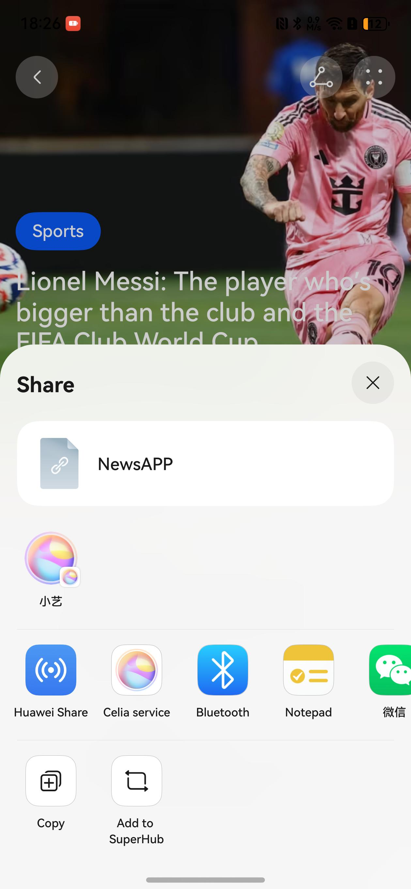

# HarmonyOS 5 News Application - System Sharing Function Implementation Case

## Summary
This article details the implementation of the system sharing function in a HarmonyOS 5.0 news application. By using the `BarButton` component and the `systemShare` module, the sharing function of news links is achieved.



## Implementation Steps
1. Create an instance of the `BarButton` component and set the sharing icon.
2. Add a click event to the `BarButton` component.
3. Create a `SharedData` object in the click event and set the sharing data.
4. Create an instance of `ShareController` and pass in the sharing data.
5. Get the UI context and call the `show` method to display the sharing interface.

## Code Implementation
```typescript
BarButton({ icon: $r('sys.media.ohos_ic_public_share') }) 
         .onClick(() => { 
           // system share 
           const data = new systemShare.SharedData({ 
             utd: uniformTypeDescriptor.UniformDataType.HYPERLINK, 
             title: 'NewsAPP', 
             content: ' `https://edition.cnn.com/` ' 
           }) 
           const controller = new systemShare.ShareController(data) 
           const ctx = this.getUIContext().getHostContext() as common.UIAbilityContext 
           controller.show(ctx, { 
             previewMode: systemShare.SharePreviewMode.DETAIL, 
             selectionMode: systemShare.SelectionMode.SINGLE 
           }) 
         }) 
```

## Conclusion
This article implements the system sharing function of the news application. Key knowledge points include the use of the `systemShare` module, the creation of `SharedData` objects and `ShareController` instances, and how to trigger the sharing operation in the click event. Through these steps, the system sharing function can be easily integrated into HarmonyOS applications.